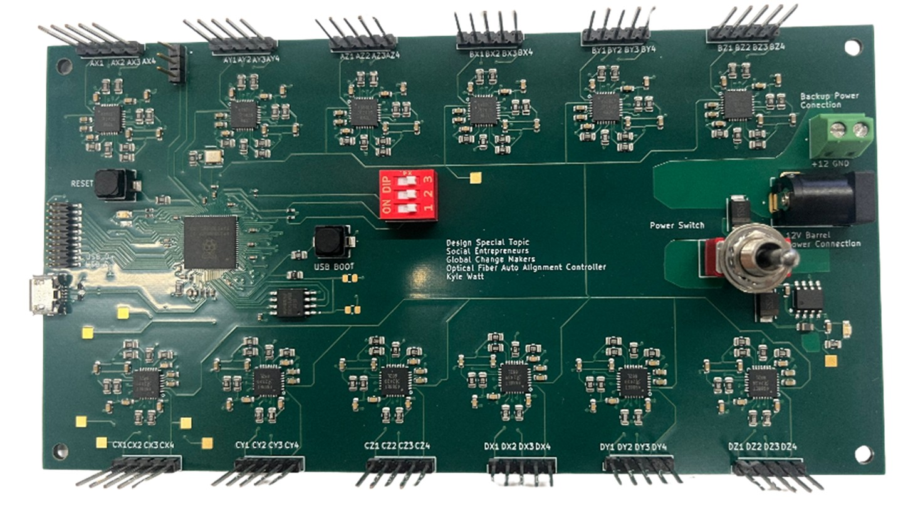

# Laser Auto-Alignment for FSOC Systems

Automated 3-axis alignment platform for Free Space Optical Communication systems using stepper motors and intelligent search algorithms.

## Features

- Sub-micron precision alignment (0.666μm steps)
- Dual search algorithms (Raster & Spiral scanning)
- Custom PCB controlling 12 stepper motors
- Real-time power optimisation
- 3D-printed mechanical components

## Hardware

- **MCU:** Raspberry Pi Pico 2350 B
- **Motors:** 12x 28BYJ-48 steppers with A4988 drivers
- **Power:** 12V input, 3.3V regulation
- **Materials:** PLA 3D-printed parts


*Custom PCB with RP2350B microcontroller and 12 A4988 motor drivers*

## Quick Start

1. Flash firmware to RP2350B
2. Assemble the mechanical system from the STL files
3. Connect via USB terminal (PuTTY/Tera Term)
4. Use the 'help' command for a detailed explanation of functions/commands
5. Run alignment algorithms: `raster`, `spiral', 'SPGD', or align with manual adjustments through manual mode or enter a control loop for continuous optimisation in automatic mode


### Manual Control
```
manual          # Enter manual control mode
centre          # Return to centre position
move x y z      # Move to specific coordinates
```

### Algorithms
```
raster <width> <height_shift> <iterations>
spiral <turns> <spacing> <points>
SPGD <iterations> <offset_range> <learning_rate> <threshold>
```

## Repository Structure

```
├── PCB/           # Schematics, gerbers, BOM
├── src/          # Firmware source
├── mechanical/    # 3D model files
└── docs/          # Detailed documentation
```

## Performance Results

| Algorithm | Starting Power | Peak Found | Improvement |
|-----------|---------------|------------|-------------|
| Raster    | -23.01 dBm    | -4.89 dBm  | 18.12 dB    |
| Spiral    | -8.99 dBm     | -6.21 dBm  | 2.78 dB     |

## PCB Design

Custom 160mm × 80mm board with:
- 6-layer stackup for signal integrity
- Switching power regulation
- EMI mitigation design
- Test points for debugging

Design files and manufacturing documentation available in `/PCB` directory.

## Software Architecture

- **Dual-core processing:** Motor control + power monitoring
- **Struct-based design:** Position tracking and optimization
- **Memory function:** Automatic return to peak power positions
- **Real-time feedback:** Power monitoring during alignment

See [full technical report](docs/full_report.pdf) for detailed performance analysis and design decisions.

## Team

- **Kyle Watt:** PCB design, software development
- **Rory Mullen:** Mechanical design, prototyping  
- **Tamim Abdul Maleque:** Component sourcing, assembly

**Supervisors:** Professor Martin Lavery, Adam Vallance, Mark Main

*University of Glasgow - School of Engineering - 2024/25*
